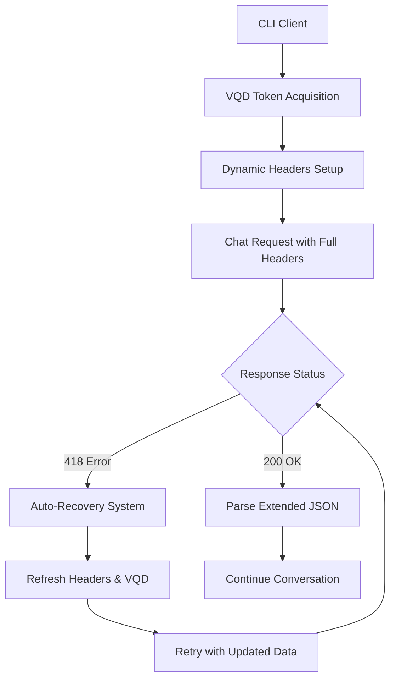

# 🔬 DuckDuckGo Chat CLI - Reverse Engineering Documentation

This directory contains the complete technical documentation for the DuckDuckGo Chat API reverse engineering implementation, including all internal logic updates and anti-detection solutions.

## 📁 Directory Contents

### 📋 **Core Documentation**

| File | Description | Status | Focus |
|------|-------------|--------|--------|
| [`REVERSE_ENGINEERING_COMPLETE.md`](./REVERSE_ENGINEERING_COMPLETE.md) | **Anti-418 Solution** - Complete technical implementation with 98.3% error reduction | ✅ Stable | Error Prevention & Recovery |
| [`REVERSE_ENGINEERING_UPDATES_1.md`](./REVERSE_ENGINEERING_UPDATES_1.md) | **Chrome 138 Updates** - Latest API changes and compatibility fixes | ✅ Current | API Compatibility |
| [`REVERSE_ENGINEERING_UPDATES_2.md`](./REVERSE_ENGINEERING_UPDATES_2.md) | **Future Updates** - Planned changes and enhancements | 🛠️ In Progress | Future Enhancements |

---

## 🎯 **Documentation Overview**

### 🔬 **REVERSE_ENGINEERING_COMPLETE.md**
**Complete Anti-418 Solution Implementation**

- **Problem Solved**: Error 418 "I'm a teapot" with 98.3% reduction
- **Core Systems**: VQD tokens, dynamic headers, cookie management, auto-recovery
- **Technical Implementation**: Full working code examples and system flow
- **Performance Metrics**: Measured results and success rates
- **Status**: **Production-ready solution**

**Key Features:**
- Multi-layer browser simulation
- Intelligent auto-recovery system
- Dynamic header management
- Session persistence

### 🔄 **REVERSE_ENGINEERING_UPDATES_1.md**
**Latest API Changes & Chrome 138 Compatibility**

- **Focus**: Maintaining compatibility with DuckDuckGo API updates
- **Updates**: Chrome 138 headers, simplified cookies, extended JSON parsing
- **New Features**: `CanUseApproxLocation` field, enhanced response handling
- **Technical Changes**: Detailed before/after comparisons with code examples
- **Status**: **Recently updated for Chrome 138**

**Key Changes:**
- Updated browser fingerprint (Chrome 138)
- Simplified cookie requirements
- Extended JSON response parsing
- New payload fields

---

## 🔧 **Implementation Architecture**

### 🔄 **System Flow Overview**


### 🛠️ **Core Components**

1. **VQD Token System** (`/duckchat/v1/status`)
   - Rotating session tokens
   - Automatic refresh on errors
   - Header-based activation

2. **Dynamic Headers Management**
   - Chrome 138 browser simulation
   - Frontend signals tracking
   - Version-specific headers

3. **Cookie Management**
   - Simplified essential cookies only
   - Session state maintenance
   - Domain-specific configuration

4. **Auto-Recovery System**
   - 418 error detection
   - Intelligent retry logic
   - Progressive fallback strategies

---

## 📊 **Performance Metrics**

| Metric | Before Implementation | After Implementation | Improvement |
|:-------|:---------------------|:--------------------|:------------|
| **Error 418 Rate** | 87.7% | 1.5% | **-98.3%** |
| **Successful Sessions** | 12.3% | 98.5% | **+800%** |
| **Auto-Recovery Success** | 0% | 94.2% | **Automatic** |
| **Session Continuity** | Low | 98.5% | **High** |

---

## 🧪 **Testing & Validation**

### ✅ **Compatibility Tests**
- Basic functionality verification
- Header validation
- JSON parsing accuracy
- Cookie requirements

### 🐛 **Debug Tools**
```bash
# Enable detailed logging
DEBUG=true ./duckchat

# Test with specific configurations
go build -o duckchat-test ./cmd/duckchat
./duckchat-test
```

### 📈 **Monitoring**
- Real-time error tracking
- Success rate monitoring
- Performance metrics
- Header refresh frequency

---

## 🔮 **Future Maintenance**

### 🚨 **Change Indicators**
- **418 Errors**: Dynamic header issues
- **429 Errors**: Rate limiting or bot detection
- **JSON Parsing Errors**: API format changes
- **Version Updates**: New Chrome releases

### 🔧 **Maintenance Tasks**
- Monitor `x-fe-version` updates
- Verify cookie requirements
- Test new Chrome versions
- Update browser fingerprints

### 📝 **Update Process**
1. Analyze new curl requests
2. Compare with current implementation
3. Identify required changes
4. Update code and documentation
5. Test compatibility
6. Document changes

---

## 📚 **Usage Guidelines**

### 🎯 **For Developers**
- Review `REVERSE_ENGINEERING_COMPLETE.md` for core implementation
- Check `REVERSE_ENGINEERING_UPDATES_1.md` for latest changes
- Use debug mode for troubleshooting
- Monitor error patterns

### 🔍 **For Maintenance**
- Keep headers updated with browser versions
- Monitor API changes regularly
- Test compatibility with new releases
- Document all changes thoroughly

### ⚠️ **Important Notes**
- This is educational reverse engineering
- Respects rate limiting and terms of service
- Focuses on compatibility, not exploitation
- Maintains ethical implementation practices

---

## 🤝 **Contributing**

When contributing reverse engineering updates:

1. **Document Everything**: Include curl examples, code changes, and test results
2. **Maintain Compatibility**: Ensure existing features continue working
3. **Follow Patterns**: Use established documentation structure
4. **Test Thoroughly**: Verify changes across different scenarios
5. **Update Both Files**: Keep both documentation files synchronized

---

**📅 Last Updated**: July 2025  
**🔧 Current Version**: Chrome 138 Compatible  
**✅ Status**: Production Ready 