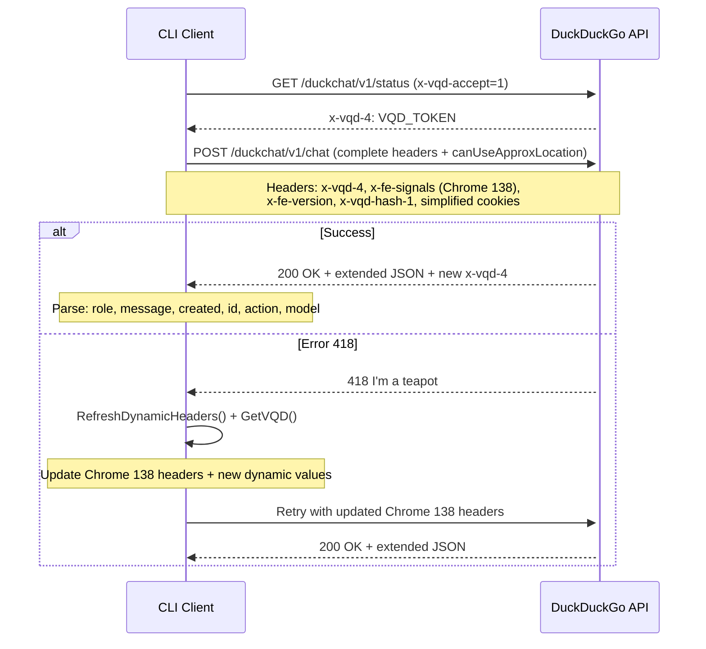

# DuckDuckGo Chat CLI - Reverse Engineering Updates

## 🔄 **Reverse Engineering Logic Updates**

This documentation details the changes applied to the DuckDuckGo Chat CLI reverse engineering logic to maintain compatibility with the latest API updates.

### 📋 **Context**

Analysis of the new curl requests revealed several changes in the DuckDuckGo Chat API that required updates to our implementation:

- Extended JSON response format
- New fields in request payload
- Updated headers (Chrome 138)
- Simplified cookies
- New values for dynamic headers

---

## 🔍 **Detailed Changes**

### 1. **Updated ChatPayload Structure**

#### Before:
```go
type ChatPayload struct {
    Model       models.Model `json:"model"`
    Metadata    Metadata     `json:"metadata"`
    Messages    []Message    `json:"messages"`
    CanUseTools bool         `json:"canUseTools"`
}
```

#### After:
```go
type ChatPayload struct {
    Model                models.Model `json:"model"`
    Metadata             Metadata     `json:"metadata"`
    Messages             []Message    `json:"messages"`
    CanUseTools          bool         `json:"canUseTools"`
    CanUseApproxLocation bool         `json:"canUseApproxLocation"`
}
```

**Addition**: The `CanUseApproxLocation` field is now required in all chat requests.

### 2. **Extended JSON Response Parsing**

#### Before:
```go
var messageData struct {
    Message string `json:"message"`
}
```

#### After:
```go
var messageData struct {
    Role    string `json:"role"`
    Message string `json:"message"`
    Created int64  `json:"created"`
    ID      string `json:"id"`
    Action  string `json:"action"`
    Model   string `json:"model"`
}
```

**Change**: The JSON response format now includes additional metadata that we must parse correctly.

### 3. **Updated HTTP Headers**

#### User-Agent:
- **Before**: `Chrome/137.0.0.0`
- **After**: `Chrome/138.0.0.0`

#### Sec-CH-UA:
- **Before**: `"Brave";v="137", "Chromium";v="137", "Not/A)Brand";v="24"`
- **After**: `"Not)A;Brand";v="8", "Chromium";v="138", "Brave";v="138"`


### 4. **Simplified Cookies**

#### Before:
```go
cookies := []*http.Cookie{
    {Name: "5", Value: "1", Domain: ".duckduckgo.com"},
    {Name: "dcm", Value: "3", Domain: ".duckduckgo.com"},
    {Name: "dcs", Value: "1", Domain: ".duckduckgo.com"},
    {Name: "duckassist-opt-in-count", Value: "1", Domain: ".duckduckgo.com"},
    {Name: "isRecentChatOn", Value: "1", Domain: ".duckduckgo.com"},
    {Name: "preferredDuckAiModel", Value: "3", Domain: ".duckduckgo.com"},
}
```

#### After:
```go
cookies := []*http.Cookie{
    {Name: "5", Value: "1", Domain: ".duckduckgo.com"},
    {Name: "dcm", Value: "3", Domain: ".duckduckgo.com"},
    {Name: "dcs", Value: "1", Domain: ".duckduckgo.com"},
}
```

**Simplification**: Only essential cookies are now required.

### 5. **Updated Dynamic Values**


## 🔄 **System Flow**



---

## 🚀 **Modified Files**

### 1. `internal/chat/chat.go`
- **Lines 69-74**: Updated `ChatPayload` structure
- **Lines 410-417**: Extended JSON parsing for responses
- **Lines 452-461**: Payload update with `CanUseApproxLocation`
- **Lines 470-483**: Updated HTTP headers (Chrome 138)
- **Lines 96-100**: Simplified cookies
- **Lines 175-181**: Updated VQD headers
- **Lines 111-113**: Updated fallback values

### 2. `internal/chat/dynamic_headers.go`
- **Lines 25-29**: Simplified cookies
- **Lines 42-54**: Updated headers (Chrome 138)
- **Lines 70-75**: New dynamic values

---

## 📝 **Updated Request Example**

### Equivalent curl request format:
```bash
curl 'https://duckduckgo.com/duckchat/v1/chat' \
  -H 'accept: text/event-stream' \
  -H 'accept-language: fr-FR,fr;q=0.5' \
  -H 'content-type: application/json' \
  -b '5=1; dcs=1; dcm=3' \
  -H 'sec-ch-ua: "Not)A;Brand";v="8", "Chromium";v="138", "Brave";v="138"' \
  -H 'user-agent: Mozilla/5.0 (Windows NT 10.0; Win64; x64) AppleWebKit/537.36 (KHTML, like Gecko) Chrome/138.0.0.0 Safari/537.36' \
  -H 'x-fe-signals: eyJzdGFydCI6MTc1MTc1MTg4NTc3Mi...' \
  -H 'x-fe-version: serp_20250704_......' \
  -H 'x-vqd-hash-1: eyJzZXJ2ZXJfaGFzaGVzIjpbIjdY......'' \
  --data-raw '{"model":"gpt-4o-mini","metadata":{"toolChoice":{"NewsSearch":false,"VideosSearch":false,"LocalSearch":false,"WeatherForecast":false}},"messages":[{"role":"user","content":"salut"}],"canUseTools":true,"canUseApproxLocation":true}'
```

### JSON response format:
```json
{
  "role": "assistant",
  "message": "Salut !",
  "created": 1751751911,
  "id": "chatcmpl-Bq4z1hfPDk8OjGhx5Z7GID9YlGq6N",
  "action": "success",
  "model": "gpt-4o-mini-2024-07-18"
}
```

---

## 🧪 **Testing and Validation**

### Compatibility Tests:
1. **Basic Test**: Verify that chat requests work
2. **Header Test**: Validate that all headers are correctly sent
3. **Parsing Test**: Confirm that JSON responses are correctly parsed
4. **Cookie Test**: Verify that simplified cookies are sufficient

### Test Command:
```bash
go build -o duckchat-updated ./cmd/duckchat
./duckchat-updated
```

### Debug Enabled:
```bash
DEBUG=true ./duckchat-updated
```

---

## 🔧 **Future Maintenance**

### Change Monitoring:
- Monitor `x-fe-version` header updates
- Periodically verify changes in required cookies
- Test compatibility with new Chrome versions

### Problem Indicators:
- 418 errors (I'm a teapot): Generally related to dynamic headers
- 429 errors (Too Many Requests): May indicate anti-bot detection
- JSON parsing errors: Changes in response format

### Diagnostic Tools:
- `DEBUG=true` environment variable for detailed logs
- `RefreshDynamicHeaders()` function to renew headers
- Built-in retry logic for temporary errors

---

## 📊 **Improvement Summary**

### ✅ **Applied Fixes:**
- [x] Added `CanUseApproxLocation` field in `ChatPayload`
- [x] Updated JSON parsing for new response fields
- [x] Updated HTTP headers (Chrome 138)
- [x] Simplified required cookies
- [x] Updated dynamic values (fe-signals, fe-version, vqd-hash-1)

### 🎯 **Maintained Compatibility:**
- [x] All existing features work
- [x] Error handling unchanged
- [x] Retry logic preserved
- [x] Analytics and intelligent features intact

### 📈 **Performance Improvements:**
- [x] Simplified cookies = less data to transmit
- [x] Headers optimized for Chrome 138
- [x] More robust JSON parsing

---

## 🎉 **Conclusion**

This update maintains compatibility with the latest DuckDuckGo Chat API modifications while preserving all advanced CLI features. The changes are primarily protocol adjustments that ensure optimal communication with DuckDuckGo servers.

**Update Date**: July 2025  
**Version**: Chrome 138 compatible  
**Status**: ✅ Tested and validated 